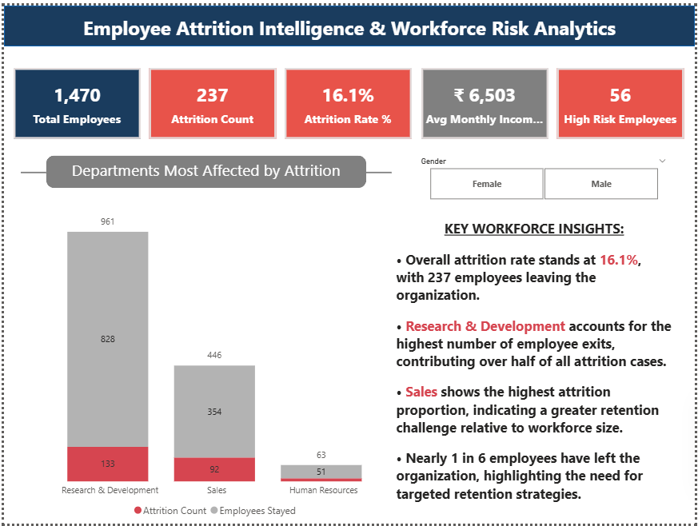
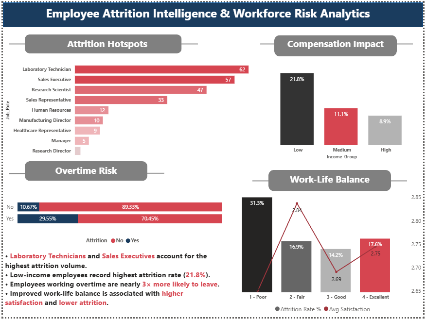
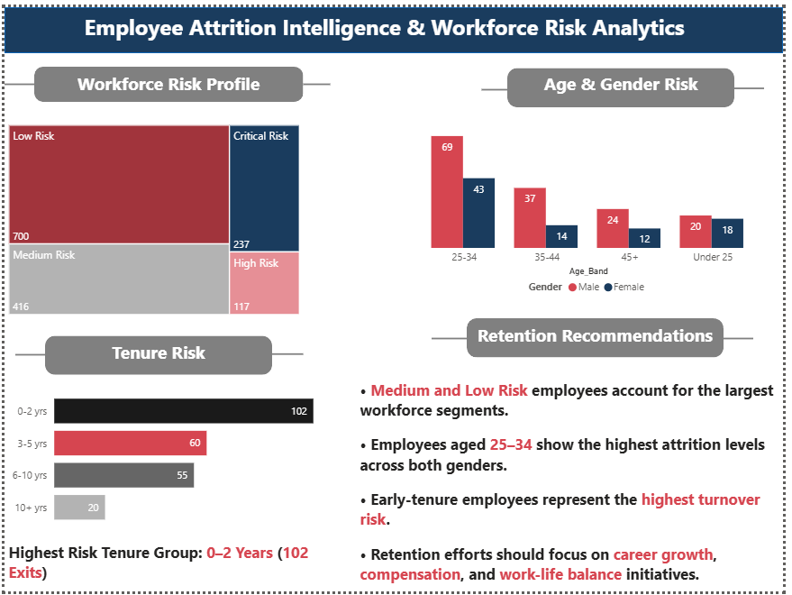

# 📊 Employee Attrition Intelligence & Workforce Risk Analytics

## 📌 Project Overview

This Power BI project analyzes employee attrition patterns across departments,
demographics, and risk categories to help HR teams make data-driven retention
decisions. The dashboard provides actionable insights into workforce risk,
compensation impact, overtime behavior, and work-life balance.

---

## 📊 Dashboard Pages

### Page 1 — Executive Overview
- 5 KPI Cards: Total Employees, Attrition Count, Attrition Rate %, Avg Monthly Income, High Risk Employees
- Department-wise attrition bar chart
- Gender slicer for filtered analysis
- Key Workforce Insights narrative panel

### Page 2 — Workforce Risk Profile
- Risk segmentation treemap (Low / Medium / High / Critical)
- Age & Gender grouped bar chart
- Tenure Risk horizontal bar chart
- Retention Recommendations panel

### Page 3 — Attrition Deep Dive
- Attrition Hotspots by Job Role
- Compensation Impact by Income Group
- Overtime Risk 100% stacked bar
- Work-Life Balance combo chart (Bar + Line)
- Detailed insight text with key statistics

---

## 🎯 Key Findings

| Insight | Value |
|---|---|
| Overall Attrition Rate | **16.1%** |
| Total Employees Who Left | **237 out of 1,470** |
| Highest Risk Department | **Research & Development** |
| Highest Attrition Age Group | **25–34 years** |
| Highest Risk Tenure | **0–2 Years (102 exits)** |
| Overtime Attrition Multiplier | **~3× more likely to leave** |
| Lowest Income Attrition Rate | **21.8%** |

---

## 🛠️ Tools & Technologies

- **Tool:** Excel | SQL | Microsoft Power BI
- **Data Source:** HR Employee Attrition Dataset (IBM Watson)
- **Data Fields Used:** Department, Job Role, Gender, Age Band,
  Monthly Income, Overtime, Work-Life Balance, Tenure, Attrition

---

## 📁 Project Structure

📦 HR-Attrition-Dashboard
┣ 📊 HR_Attrition.pbix        # Main Power BI file
┣ 📸 screenshots/
┃ ┣ page1_executive_overview.png
┃ ┣ page2_workforce_risk.png
┃ ┗ page3_attrition_deepdive.png
┣ 📄 README.md

---

## 📸 Dashboard Preview

### Page 1 — Executive Overview


### Page 2 — Workforce Risk Profile


### Page 3 — Attrition Deep Dive


---

## 💡 DAX Measures Used

```dax
--Total Employees
Total Employees =  COUNT(HR_Data[Employee_Number])

--Attrition Count
Attrition Count = CALCULATE(COUNTROWS(HR_Data), HR_Data[Attrition] = "Yes")

--Attrition Rate %
Attrition Rate % = DIVIDE([Attrition Count], [Total Employees]) * 100

--Avg Monthly Income
Avg Monthly Income = AVERAGE(HR_Data[Monthly_Income])

--Avg Tenure Years
Avg Tenure Years = AVERAGE(HR_Data[Years_At_Company])

--High Risk Employees
High Risk Employees =
CALCULATE(
    COUNTROWS(HR_Data),
    HR_Data[Attrition] = "No",
    HR_Data[OverTime] = "Yes",
    HR_Data[Job_Satisfaction] <= 2
)

--Cumulative Attrition %
Cumulative Attrition % = 
VAR CurrentAttrition =
    [Attrition Count]
VAR RunningTotal =
    CALCULATE(
        [Attrition Count],
        FILTER(
            ALL(HR_Data[Job_Role]),
            [Attrition Count] >= CurrentAttrition
        )
    )
VAR TotalAttrition =
    CALCULATE(
        [Attrition Count],
        ALL(HR_Data[Job_Role])
    )
RETURN
DIVIDE(
    RunningTotal,
    TotalAttrition
) * 100

```

---

## 👤 Author

**Khushi Duggelwar**  
📧 khushivrao61@gmail.com  
🔗 [LinkedIn](https://linkedin.com/in/khushiduggelwar)  
🐙 [GitHub](https://github.com/khushiduggelwar)

---

## 📃 License

This project is for educational and portfolio purposes.  
Dataset: [IBM HR Analytics Employee Attrition Dataset](https://www.kaggle.com/datasets/pavansubhasht/ibm-hr-analytics-attrition-dataset)

---

⭐ **If you found this project useful, please give it a star!** ⭐
